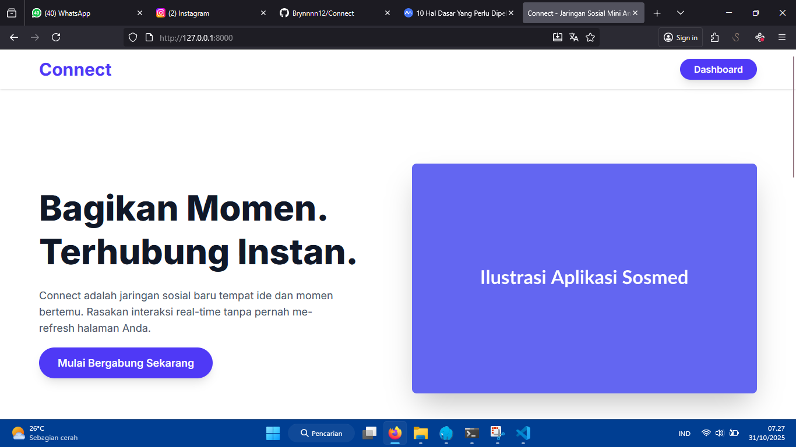
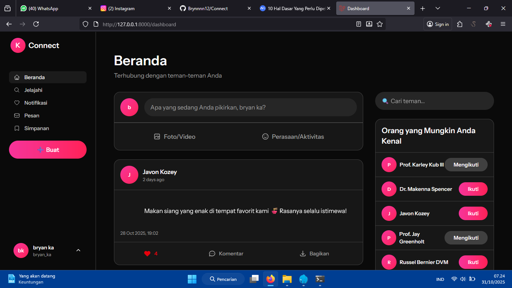
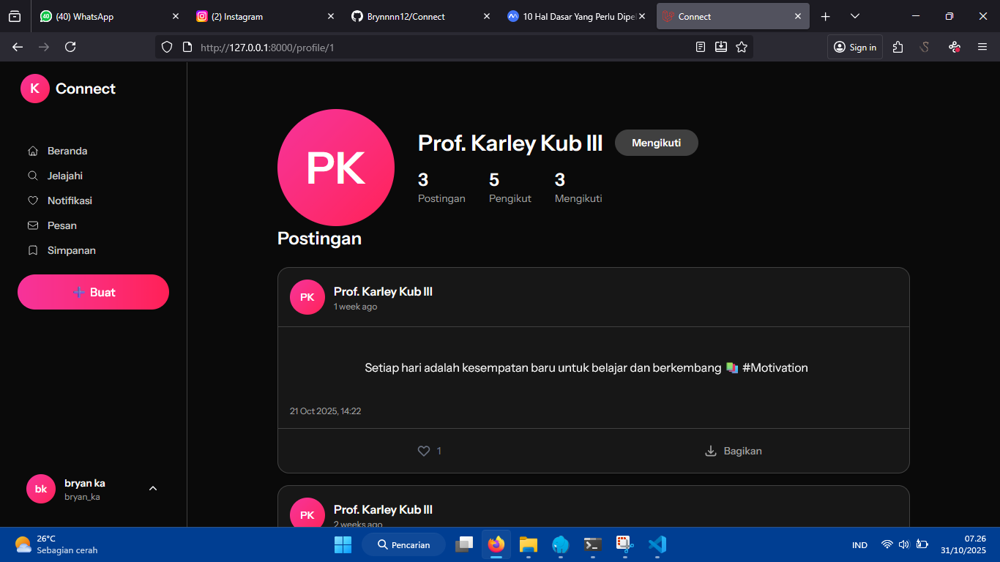

# 🚀 Connect - Modern Social Media Platform

> **Connect** adalah platform social media modern yang dibangun dengan **TALL Stack** (Tailwind CSS, Alpine.js, Laravel, Livewire). Aplikasi ini menyediakan fitur-fitur lengkap seperti Instagram dengan design yang responsif, real-time updates, dan performa optimal untuk experience pengguna yang luar biasa.

---

## 🎬 Demo Screenshots

Lihat tampilan aplikasi Connect dalam aksi:

### 🏠 Home / Welcome Page


_Halaman utama welcome yang menyambut pengguna baru_

### � Dashboard / Main Feed


_Feed utama dengan postingan dari user yang diikuti, like button, dan suggested users_

### 👤 User Profile Page


_Halaman profil user dengan statistik (posts, followers, following) dan semua postingan user_

---

## �📌 Tentang Connect

**Connect** adalah solusi social media lengkap yang memungkinkan user untuk:

-   📝 **Membuat & Berbagi Postingan** - Tulis pemikiran Anda dan bagikan dengan komunitas
-   ❤️ **Memberikan Like** - Apresiasi postingan dari user lain secara real-time
-   👥 **Follow/Unfollow User** - Ikuti user favorit Anda dan bangun komunitas
-   👤 **Lihat Profil Public** - Jelajahi profil user lain dengan statistik lengkap
-   💬 **Interaksi Real-time** - Semua update terjadi secara instant tanpa page refresh
-   🌙 **Dark Mode** - Mode gelap yang nyaman untuk mata

Dibangun dengan teknologi terkini dan best practices modern development, Connect siap untuk scale dan production use.

### 🎯 Target Pengguna

-   👨‍💻 Developer yang ingin belajar TALL Stack
-   🚀 Startup yang membutuhkan social media MVP
-   🎓 Siswa yang ingin portfolio project
-   🏢 Perusahaan yang membutuhkan internal community platform

---

## 🎯 TALL Stack Architecture

**TALL Stack** adalah kombinasi modern untuk membangun aplikasi web full-stack:

| Komponen             | Fungsi                 | Benefit                                |
| -------------------- | ---------------------- | -------------------------------------- |
| **T** - Tailwind CSS | Styling & UI           | Rapid development, consistent design   |
| **A** - Alpine.js    | Frontend interactivity | Lightweight alternative to Vue/React   |
| **L** - Laravel      | Backend framework      | Powerful, secure, well-tested          |
| **L** - Livewire     | Component framework    | Real-time UI tanpa JavaScript kompleks |

Dengan TALL Stack, Anda bisa membuat aplikasi interaktif full-stack **hanya dengan PHP**, tanpa perlu menguasai JavaScript framework yang kompleks seperti Vue atau React.

### 🏗️ Architecture Overview

```
┌─────────────────────────────────────────────────────┐
│              CLIENT SIDE (Browser)                  │
│  ┌────────────────────────────────────────────────┐ │
│  │ Tailwind CSS + Alpine.js                       │ │
│  │ (Beautiful UI + Client Interactivity)          │ │
│  │ - Responsive Design                            │ │
│  │ - Dark Mode Support                            │ │
│  │ - Smooth Animations                            │ │
│  └────────────────────────────────────────────────┘ │
└──────────────────┬──────────────────────────────────┘
                   │ WebSocket / HTTP (Real-time)
┌──────────────────▼──────────────────────────────────┐
│         SERVER SIDE (Laravel Backend)               │
│  ┌────────────────────────────────────────────────┐ │
│  │ Livewire Components (Volt Syntax)              │ │
│  │ - Real-time reactive components                │ │
│  │ - Event dispatching & listening                │ │
│  │ - Computed properties with caching             │ │
│  └────────────────────────────────────────────────┘ │
│  ┌────────────────────────────────────────────────┐ │
│  │ Laravel Routes & Controllers                   │ │
│  │ - Request handling                             │ │
│  │ - Business logic                               │ │
│  │ - Authentication & Authorization               │ │
│  └────────────────────────────────────────────────┘ │
│  ┌────────────────────────────────────────────────┐ │
│  │ Eloquent ORM & Models                          │ │
│  │ - Database interaction                         │ │
│  │ - Relationships & eager loading                │ │
│  │ - Query optimization                           │ │
│  └────────────────────────────────────────────────┘ │
└──────────────────┬──────────────────────────────────┘
                   │ SQL Queries
┌──────────────────▼──────────────────────────────────┐
│              DATABASE (MySQL 8.0+)                  │
│  ┌────────────────────────────────────────────────┐ │
│  │ Tables:                                        │ │
│  │ - users (authentication & profile)             │ │
│  │ - posts (user content)                         │ │
│  │ - likes (user engagement)                      │ │
│  │ - followers (user relationships)               │ │
│  └────────────────────────────────────────────────┘ │
└─────────────────────────────────────────────────────┘
```

---

## ✨ Fitur Utama

### 📱 Posting & Dashboard System

**Membuat Postingan:**

-   ✅ Modal interaktif untuk membuat postingan baru
-   ✅ Real-time character counter dan validation
-   ✅ Minimal 3 karakter, maksimal 2000 karakter
-   ✅ Postingan langsung muncul di feed tanpa refresh
-   ✅ Timestamp otomatis dan timezone awareness

**Mengedit Postingan:**

-   ✅ Edit postingan milik sendiri melalui menu actions
-   ✅ Modal membuka dengan konten sebelumnya
-   ✅ Konfirmasi sebelum update
-   ✅ Riwayat updated_at otomatis tercatat

**Menghapus Postingan:**

-   ✅ Soft delete dengan cascading relationships
-   ✅ Konfirmasi dengan wire:confirm dialog
-   ✅ Hanya pemilik postingan yang bisa menghapus
-   ✅ Instant removal dari feed

**Dashboard Feed:**

-   ✅ Menampilkan postingan dari user yang diikuti
-   ✅ Order by created_at terbaru
-   ✅ Pagination untuk performance
-   ✅ Infinite scroll capability (dapat di-extend)
-   ✅ Suggested users untuk follow

### ❤️ Like System - Real-time Engagement

**Like/Unlike Features:**

-   ✅ Klik icon hati untuk like postingan
-   ✅ Icon berubah merah saat sudah di-like
-   ✅ Counter update instantly (real-time)
-   ✅ Smooth animation saat like/unlike
-   ✅ Prevent self-like functionality
-   ✅ Like status persist di database

**Performance Optimized:**

-   ✅ Eager loading dengan `with('likes')`
-   ✅ Query count optimization dengan `loadCount()`
-   ✅ Computed properties untuk caching
-   ✅ Efficient database queries

**User Experience:**

-   ✅ Instant visual feedback
-   ✅ Loading states saat processing
-   ✅ Disabled state sebelum login
-   ✅ Like count bubble tampil di setiap post

### 👥 Follow System - Build Community

**Follow/Unfollow:**

-   ✅ Follow user dari profile page
-   ✅ Button berubah status "Ikuti" ↔ "Mengikuti"
-   ✅ Real-time follower count update
-   ✅ Prevent self-follow functionality
-   ✅ Cascade delete saat user dihapus

**Suggested Users:**

-   ✅ Rekomendasi user untuk diikuti
-   ✅ Exclude sudah di-follow users
-   ✅ Random selection untuk variasi
-   ✅ Click-to-follow tanpa perlu buka profile

**Follower/Following Stats:**

-   ✅ Tampilkan jumlah pengikut (followers)
-   ✅ Tampilkan jumlah sedang diikuti (following)
-   ✅ Update real-time saat follow/unfollow
-   ✅ Clickable untuk melihat daftar followers

**Real-time Event Dispatch:**

-   ✅ Event `followStatusChanged` dipancarkan
-   ✅ Profile component listen ke event
-   ✅ Count otomatis ter-refresh
-   ✅ Zero latency updates

### 👤 User Profile - Public Profiles

**Public Profile View:**

-   ✅ Buka dengan route `/profile/{user-id}`
-   ✅ Lihat profil user lain (publicly accessible)
-   ✅ Avatar gradient dengan inisial user
-   ✅ Nama dan info dasar user

**Profile Statistics:**

-   ✅ Total postingan milik user
-   ✅ Jumlah followers yang mengikuti
-   ✅ Jumlah user yang sedang diikuti
-   ✅ Real-time count update

**User's Posts Display:**

-   ✅ Tampilkan semua postingan user (desc by created_at)
-   ✅ Setiap post bisa di-like
-   ✅ Empty state jika belum ada postingan
-   ✅ Post with like button dan timestamp

**Edit Own Profile:**

-   ✅ Access melalui menu profil di sidebar
-   ✅ Edit nama lengkap
-   ✅ Edit email address
-   ✅ Form validation & error messages
-   ✅ Success notification setelah update

### 🎨 Design & UX Features

**Instagram-like Design:**

-   ✅ Modern card-based layout
-   ✅ Sidebar navigation dengan Flux UI
-   ✅ Post cards dengan detailed actions
-   ✅ Hover effects dan interactive states
-   ✅ Pink/Rose gradient theme

**Responsive Layout:**

-   ✅ Mobile-first responsive design
-   ✅ Bekerja sempurna di semua screen sizes
-   ✅ Grid responsive untuk posts
-   ✅ Hamburger menu untuk mobile
-   ✅ Touch-friendly button sizes

**Dark Mode Support:**

-   ✅ Full dark mode implementation
-   ✅ Toggle dark mode di settings
-   ✅ Persistent dark mode preference
-   ✅ Smooth transitions antara mode
-   ✅ Tailwind dark: classes

**Smooth Transitions & Animations:**

-   ✅ Like button heart animation
-   ✅ Modal open/close transitions
-   ✅ Hover effects pada buttons
-   ✅ Fade in untuk new posts
-   ✅ Loading skeleton screens

**Loading States & Feedback:**

-   ✅ Button loading state dengan spinner
-   ✅ Disabled state saat processing
-   ✅ Success/error notifications
-   ✅ Toast messages untuk feedback
-   ✅ Empty state illustrations

---

## 🛠 Tech Stack Detail

### 🎯 TALL Stack Components

#### **T - Tailwind CSS**

```
Utility-first CSS framework untuk styling modern
- Pre-built classes untuk rapid development
- Responsive design built-in (mobile-first)
- Dark mode support penuh
- Customizable theme
```

**Keuntungan:**

-   ✅ Kecepatan development 2-3x lebih cepat
-   ✅ File CSS lebih kecil (tree-shaking)
-   ✅ Konsistensi design sistem
-   ✅ Mudah customize dan extend

#### **A - Alpine.js**

```
Lightweight JavaScript framework untuk interactivity
- Hanya 15KB gzipped
- Direct DOM manipulation
- Perfect untuk progressive enhancement
- Tidak perlu build step untuk sebagian use case
```

**Keuntungan:**

-   ✅ Performa maksimal (lightweight)
-   ✅ Learning curve rendah
-   ✅ Cocok untuk UI sederhana-menengah
-   ✅ Integrasi seamless dengan Laravel

#### **L - Laravel**

```
Full-stack web framework PHP yang powerful
- Elegant syntax dan developer experience
- Built-in authentication & authorization
- Database ORM (Eloquent) yang powerful
- Comprehensive routing & middleware
```

**Keuntungan:**

-   ✅ Security best practices built-in
-   ✅ Dokumentasi lengkap dan community besar
-   ✅ Rapid development tools & commands
-   ✅ Scalable architecture

#### **L - Livewire**

```
Real-time reactive components untuk Laravel
- Build dynamic components hanya dengan PHP
- Real-time UI updates tanpa JavaScript kompleks
- Event-driven architecture
- File per component yang clean
```

**Keuntungan:**

-   ✅ Full-stack development hanya PHP
-   ✅ Real-time features tanpa API kompleks
-   ✅ Developer experience yang superior
-   ✅ Reduced JavaScript complexity

### 📦 Tech Stack Lengkap

| Layer               | Technology   | Version | Purpose                 |
| ------------------- | ------------ | ------- | ----------------------- |
| **Backend**         | Laravel      | 12.36.1 | Web framework           |
| **Backend**         | Livewire     | 3       | Real-time components    |
| **Backend**         | PHP          | 8.3.12  | Programming language    |
| **Frontend**        | Tailwind CSS | 3       | Styling                 |
| **Frontend**        | Alpine.js    | 3       | Interactivity           |
| **Frontend**        | Flux UI      | Latest  | Component library       |
| **Database**        | MySQL        | 8.0+    | Data storage            |
| **Build Tool**      | Vite         | Latest  | Frontend bundling       |
| **Package Manager** | Composer     | Latest  | PHP dependencies        |
| **Package Manager** | npm          | Latest  | JavaScript dependencies |

---

## 🚀 Mengapa TALL Stack?

### Dibanding dengan Tech Stack Lain

| Aspek               | TALL Stack             | Vue/React            | Traditional Laravel |
| ------------------- | ---------------------- | -------------------- | ------------------- |
| Learning Curve      | ⭐⭐⭐ (Rendah)        | ⭐ (Sangat tinggi)   | ⭐⭐ (Sedang)       |
| Developer Speed     | ⭐⭐⭐⭐⭐ (Cepat)     | ⭐⭐⭐⭐ (Cepat)     | ⭐⭐⭐ (Normal)     |
| Performance         | ⭐⭐⭐⭐ (Excellent)   | ⭐⭐⭐⭐ (Excellent) | ⭐⭐⭐ (Good)       |
| Bundle Size         | ⭐⭐⭐⭐⭐ (Kecil)     | ⭐⭐ (Besar)         | ⭐⭐⭐⭐ (Medium)   |
| Real-time Features  | ⭐⭐⭐⭐⭐ (Easy)      | ⭐⭐⭐⭐ (Moderate)  | ⭐⭐ (Hard)         |
| Backend Integration | ⭐⭐⭐⭐⭐ (Native)    | ⭐⭐⭐ (Via API)     | ⭐⭐⭐⭐ (Native)   |
| Team Productivity   | ⭐⭐⭐⭐⭐ (Very High) | ⭐⭐⭐⭐ (High)      | ⭐⭐⭐ (Moderate)   |

### Use Cases Ideal untuk TALL Stack

✅ **Perfect untuk:**

-   Social media platforms
-   Real-time dashboards
-   Admin panels
-   CMS applications
-   Chat applications
-   Collaborative tools
-   Startup MVPs
-   Full-stack monolithic applications

❌ **Kurang ideal untuk:**

-   Highly interactive SPAs (gunakan Vue/React)
-   Mobile apps (gunakan React Native)
-   Static sites (gunakan Astro/Static generators)

---

## 📋 Daftar Isi

-   [Tentang Connect](#tentang-connect)
-   [TALL Stack Architecture](#tall-stack-architecture)
-   [Fitur Utama](#fitur-utama)
-   [Tech Stack Detail](#tech-stack-detail)
-   [Instalasi](#instalasi)
-   [Menjalankan Aplikasi](#menjalankan-aplikasi)
-   [Struktur Folder](#struktur-folder)
-   [Fitur Detail - Flow & Use Cases](#-fitur-detail---flow--use-cases)
-   [Component Architecture Breakdown](#-component-architecture-breakdown)
-   [Real-time Event Flow](#-real-time-event-flow---detailed-sequence)
-   [Database Schema](#-database-schema)
-   [Livewire Component Guide](#-livewire-component-guide---penjelasan-lengkap)
-   [Production Deployment](#production-deployment)
-   [Security Best Practices](#security-best-practices)
-   [TALL Stack Best Practices](#tall-stack-best-practices)
-   [Troubleshooting](#troubleshooting)
-   [Learning Path](#learning-path-untuk-tall-stack)

---

## 📥 Instalasi

### Prerequisites

Pastikan sudah install:

-   PHP 8.3+
-   Composer
-   Node.js & npm
-   MySQL 8.0+
-   Git

### Step 1: Clone Repository

```bash
git clone https://github.com/Brynnnn12/Connect.git
cd Connect
```

### Step 2: Install Dependencies

```bash
# Install PHP dependencies
composer install

# Install JavaScript dependencies
npm install
```

### Step 3: Setup Environment

```bash
# Copy .env.example ke .env
cp .env.example .env

# Generate application key
php artisan key:generate
```

### Step 4: Konfigurasi Database

Buka file `.env` dan sesuaikan konfigurasi database:

```env
DB_CONNECTION=mysql
DB_HOST=127.0.0.1
DB_PORT=3306
DB_DATABASE=connect
DB_USERNAME=root
DB_PASSWORD=
```

Buat database baru:

```bash
mysql -u root -p
> CREATE DATABASE connect;
> EXIT;
```

### Step 5: Database Migration & Seeding

```bash
# Jalankan migrations dan seeder
php artisan migrate:fresh --seed

# Atau hanya migration (tanpa dummy data)
php artisan migrate
```

**Data yang dibuat oleh seeder:**

-   5 user dummy dengan data faker
-   15 posts (3 per user)
-   Relationships: follows dan likes
-   Test data lengkap untuk development

---

## ▶️ Menjalankan Aplikasi

### Development Server

Terminal 1 - Laravel Development Server:

```bash
php artisan serve
```

Terminal 2 - Vite Development Server (untuk CSS/JS):

```bash
npm run dev
```

Aplikasi akan tersedia di: **http://127.0.0.1:8000**

### Login dengan Dummy Account

Setelah menjalankan `php artisan migrate:fresh --seed`, Anda bisa login dengan:

```
Email: arely.hahn@example.org (atau user lain yang di-seed)
Password: password
```

Atau lihat user yang tersedia:

```bash
php artisan tinker
>>> User::all(['name', 'email'])->toArray();
```

### Build untuk Production

```bash
# Build frontend assets
npm run build

# Deploy siap production
```

---

## 📁 Struktur Folder

```
Connect/
├── app/
│   ├── Http/
│   │   └── Controllers/        # HTTP Controllers
│   ├── Livewire/
│   │   ├── Posts/
│   │   │   ├── PostModal.php   # Modal buat/edit post
│   │   │   └── PostList.php    # List posts component
│   │   └── Actions/
│   ├── Models/
│   │   ├── User.php            # User model + relationships
│   │   ├── Post.php            # Post model
│   │   └── Like.php            # Like model (pivot table)
│   └── Providers/              # Service providers
├── database/
│   ├── migrations/             # Database migrations
│   │   ├── 0001_01_01_000000_create_users_table.php
│   │   ├── 2025_10_30_155215_create_posts_table.php
│   │   ├── 2025_10_30_155236_create_likes_table.php
│   │   └── 2025_10_30_155244_create_followers_table.php
│   ├── factories/              # Model factories
│   │   ├── UserFactory.php
│   │   └── PostFactory.php
│   └── seeders/
│       └── DatabaseSeeder.php  # Database seeder
├── resources/
│   ├── css/
│   │   └── app.css             # Global styles
│   ├── js/
│   │   └── app.js              # Global scripts
│   └── views/
│       ├── livewire/           # Livewire Volt components
│       │   ├── posts/
│       │   │   ├── post-modal.blade.php      # Create/edit modal
│       │   │   └── post-list.blade.php       # Posts feed
│       │   ├── likes/
│       │   │   └── like-button.blade.php     # Like button
│       │   ├── follows/
│       │   │   └── follow-button.blade.php   # Follow button
│       │   ├── pages/
│       │   │   └── profile.blade.php         # User profile page
│       │   └── settings/
│       │       └── profile.blade.php         # Edit profile
│       ├── components/         # Reusable components
│       │   ├── layouts/
│       │   │   └── app/
│       │   │       ├── sidebar.blade.php     # Sidebar navigation
│       │   │       ├── header.blade.php      # Top header
│       │   │       └── app.blade.php         # Main layout
│       │   └── ...
│       ├── dashboard.blade.php # Main feed
│       ├── profile.blade.php   # Profile view
│       └── welcome.blade.php   # Welcome page
├── routes/
│   ├── web.php                 # Web routes
│   └── console.php             # Console commands
├── tests/
│   ├── Feature/                # Feature tests
│   │   └── DashboardTest.php
│   └── Unit/                   # Unit tests
├── storage/
│   ├── app/
│   ├── framework/
│   └── logs/
├── config/
│   ├── app.php
│   ├── database.php
│   ├── cache.php
│   └── ...
├── bootstrap/
│   ├── app.php
│   └── providers.php
├── public/                     # Public assets
│   ├── index.php
│   ├── robots.txt
│   └── build/
├── vendor/                     # Composer packages
├── node_modules/               # npm packages
├── package.json
├── composer.json
├── vite.config.js
├── tailwind.config.js
└── README.md
```

---

## 🎯 Livewire Component Guide - Penjelasan Lengkap

### Apa itu Livewire Component?

Livewire adalah framework revolusioner yang memungkinkan Anda membuat interactive components menggunakan **hanya PHP** - tanpa perlu menguasai JavaScript framework kompleks seperti Vue atau React.

**Keuntungan Livewire:**

```
Traditional: PHP → Backend → JSON Response → JavaScript → DOM Update
Livewire:    PHP → Backend → HTML Delta → Livewire JS → DOM Update (MUCH SIMPLER!)
```

**Bagaimana Livewire Bekerja:**

1. **User berinteraksi** di browser (klik button, typing, dll)
2. **Livewire JavaScript** menangkap event
3. **Request dikirim** ke server dengan data terbaru
4. **Component PHP** di-render ulang
5. **HTML delta** dihitung (hanya bagian yang berubah)
6. **Browser menerima delta** dan update DOM secara cerdas
7. **UI ter-update** tanpa full page refresh

### Contoh Livewire Component Sederhana

```php
<?php
use Livewire\Volt\Component;

new class extends Component {
    // 1. STATE (Data yang reactive)
    public string $message = 'Hello World';
    public int $count = 0;

    // 2. COMPUTED PROPERTIES (Cached calculations)
    #[Livewire\Attributes\Computed]
    public function messageLength()
    {
        return strlen($this->message);
    }

    // 3. METHODS (Logic yang dipanggil)
    public function increment()
    {
        $this->count++;
    }

    public function submit()
    {
        // Ini dijalankan di server, bukan client!
        logger('Message submitted: ' . $this->message);
    }
}; ?>

<!-- HTML View -->
<div class="space-y-4">
    <!-- wire:model = Two-way binding -->
    <input wire:model="message"
           class="border rounded px-3 py-2"
           placeholder="Type something...">

    <!-- Tampilkan nilai property -->
    <p>You typed: {{ $message }}</p>
    <p>Length: {{ $this->messageLength }} characters</p>

    <!-- wire:click = Event listener -->
    <button wire:click="increment"
            class="bg-blue-500 text-white px-4 py-2 rounded">
        Increment: {{ $count }}
    </button>

    <!-- Form submission -->
    <button wire:click="submit"
            class="bg-green-500 text-white px-4 py-2 rounded">
        Submit
    </button>
</div>
```

### Component Structure di Connect

Connect menggunakan **Volt** - syntaks terbaru Livewire (single-file components):

```
resources/views/livewire/
├── posts/
│   ├── post-modal.blade.php          # Create/Edit Modal
│   │   └── State: $postId, $content, $showModal
│   │   └── Methods: openModal(), edit(), save(), delete()
│   │
│   └── post-list.blade.php           # Feed Display
│       └── State: $posts (Collection)
│       └── Loops through posts dengan @foreach
│
├── likes/
│   └── like-button.blade.php         # Like Button Component
│       └── State: $post (Post model), $isLiked, $likeCount
│       └── Methods: mount(), toggleLike()
│       └── Emits: Dispatch 'postCreated' event
│
├── follows/
│   └── follow-button.blade.php       # Follow Button Component
│       └── State: $user (User model), $isFollowing
│       └── Methods: mount(), toggleFollow()
│       └── Emits: Dispatch 'followStatusChanged' event
│
└── pages/
    └── profile.blade.php             # User Profile Page (Volt Route)
        └── State: $user, $posts, $postCount, $followersCount
        └── Listeners: #[On('followStatusChanged')]
        └── Methods: mount(), loadUserData(), refreshFollowerCount()
```

### Livewire Directives Detail

#### 1️⃣ `wire:model` - Two-way Reactive Binding

```blade
<!-- Basic binding - updates on blur -->
<input wire:model="message" />

<!-- Real-time - updates as you type -->
<input wire:model.live="message" />

<!-- Debounce - waits 300ms after stop typing -->
<input wire:model.debounce.300ms="message" />

<!-- Lazy - updates only on blur -->
<input wire:model.lazy="message" />

<!-- Modifiers dapat di-combine -->
<textarea wire:model.live.debounce.500ms="content"></textarea>
```

#### 2️⃣ `wire:click` - Event Listener

```blade
<!-- Simple method call -->
<button wire:click="toggleLike">Like</button>

<!-- Pass parameters -->
<button wire:click="delete({{ $post->id }})">Delete</button>

<!-- Confirmation dialog -->
<button wire:click="delete({{ $post->id }})"
        wire:confirm="Are you sure?">Delete</button>

<!-- Debounce - prevent multiple clicks -->
<button wire:click.debounce="save">Save</button>

<!-- Prevent default -->
<form wire:submit.prevent="handleSubmit">
    <input type="email" />
    <button type="submit">Submit</button>
</form>
```

#### 3️⃣ `wire:navigate` - SPA-like Navigation

```blade
<!-- Navigate tanpa full page reload -->
<a wire:navigate href="{{ route('profile', $user) }}">
    {{ $user->name }}
</a>

<!-- Dengan parameter -->
<a wire:navigate href="/profile/{{ $user->id }}">View Profile</a>

<!-- Back button -->
<button wire:navigate.back>Go Back</button>
```

#### 4️⃣ `wire:key` - Component Tracking dalam Loop

```blade
<!-- PENTING: Always use wire:key dalam @foreach! -->
@foreach ($posts as $post)
    <livewire:like-button :post="$post"
                          wire:key="like-{{ $post->id }}" />
@endforeach

<!-- Tanpa wire:key, Livewire kesulitan track component -->
<!-- Component bisa ter-mix atau hilang saat list berubah! -->
```

#### 5️⃣ Computed Properties - Cached Calculations

```php
// ✅ BAIK - Cached automatic
#[Livewire\Attributes\Computed]
public function isFollowing()
{
    return auth()->user()->following()
        ->where('following_user_id', $this->user->id)
        ->exists();
}

// ❌ BURUK - Query setiap kali diakses
public function getIsFollowing()
{
    return auth()->user()->following()
        ->where('following_user_id', $this->user->id)
        ->exists();
}
```

---

## ⚡ Event Handling & Real-time Flow Dijelaskan

### Bagaimana Real-time Update Bekerja?

Connect menggunakan **Livewire event dispatching** - callback pattern untuk inter-component communication:

```
┌─────────────────────────────────────────────────────────┐
│ 1. USER CLICKS FOLLOW BUTTON                            │
│    Button di follow-button.blade.php di-klik            │
└──────────────────┬──────────────────────────────────────┘
                   │
┌──────────────────▼──────────────────────────────────────┐
│ 2. FOLLOW BUTTON COMPONENT FIRES METHOD                 │
│    public function toggleFollow() {                     │
│        auth()->user()->following()->toggle($user->id);  │
│        $this->isFollowing = !$this->isFollowing;        │
│        $this->dispatch('followStatusChanged');          │
│    }                                                     │
└──────────────────┬──────────────────────────────────────┘
                   │
┌──────────────────▼──────────────────────────────────────┐
│ 3. DATABASE UPDATED                                     │
│    - Relationship di-attach/di-detach                   │
│    - followers table ter-update                         │
└──────────────────┬──────────────────────────────────────┘
                   │
┌──────────────────▼──────────────────────────────────────┐
│ 4. EVENT DISPATCHED (Global)                            │
│    $this->dispatch('followStatusChanged')               │
│    - Event name dibroadcast                             │
│    - Semua component yang listen akan notified          │
└──────────────────┬──────────────────────────────────────┘
                   │
┌──────────────────▼──────────────────────────────────────┐
│ 5. PROFILE COMPONENT LISTENER ACTIVATED                 │
│    #[On('followStatusChanged')]                         │
│    public function refreshFollowerCount() {             │
│        $this->user->refresh();                          │
│        $this->loadUserData();                           │
│    }                                                     │
└──────────────────┬──────────────────────────────────────┘
                   │
┌──────────────────▼──────────────────────────────────────┐
│ 6. PROFILE COMPONENT RE-RENDERS                         │
│    - Data di-reload dari database                       │
│    - $followersCount di-update                          │
│    - HTML baru di-generate                              │
└──────────────────┬──────────────────────────────────────┘
                   │
┌──────────────────▼──────────────────────────────────────┐
│ 7. LIVEWIRE DELTA DIFFING                               │
│    - Hanya bagian yang berubah dihitung                 │
│    - HTML delta dikirim ke browser                      │
│    - Not entire component!                              │
└──────────────────┬──────────────────────────────────────┘
                   │
┌──────────────────▼──────────────────────────────────────┐
│ 8. DOM UPDATED IN BROWSER                               │
│    - Follower count UI ter-update                       │
│    - Smooth transition (Livewire.js handles it)         │
│    - User sees instant update ✨                        │
│    - No page refresh needed!                            │
└─────────────────────────────────────────────────────────┘
```

### Real-time Features di Connect dengan Detail

| Feature         | Dispatcher Component    | Listener Component  | Event Name              | Latency |
| --------------- | ----------------------- | ------------------- | ----------------------- | ------- |
| **Like Post**   | like-button.blade.php   | like-button.blade   | (internal state update) | <50ms   |
| **Follow User** | follow-button.blade.php | profile.blade.php   | `followStatusChanged`   | <100ms  |
| **Create Post** | post-modal.blade.php    | post-list.blade.php | (parent refresh)        | <200ms  |
| **Edit Post**   | post-modal.blade.php    | post-list.blade.php | (parent refresh)        | <200ms  |
| **Delete Post** | post-list.blade.php     | post-list.blade.php | (list update)           | <150ms  |

---

## 🎯 Fitur Detail - Flow & Use Cases

### 1. 📝 Posting System - Complete Flow

#### A. Membuat Postingan

**Step-by-step flow:**

```
User Flow:
1. Klik tombol "➕ Buat" di sidebar
   ↓
2. PostModal component opens (wire:click trigger)
   ↓
3. Modal form muncul dengan textarea
   ↓
4. User typing → wire:model.debounce updates $content
   ↓
5. Real-time validation: min 3 char, max 2000 char
   ↓
6. Button "Posting" aktif saat content valid
   ↓
7. Klik "Posting" → wire:click="save" fired
   ↓
8. Laravel validates content
   ↓
9. Database: INSERT ke posts table
   ↓
10. PostList component refresh
   ↓
11. New post muncul di TOP feed
   ↓
12. Modal closes, user sees postingan mereka!
```

**Backend Logic:**

```php
// resources/views/livewire/posts/post-modal.blade.php
public function save(): void
{
    $validated = $this->validate([
        'content' => 'required|min:3|max:2000',
    ]);

    if ($this->postId) {
        // Update existing post
        $post = Post::findOrFail($this->postId);
        $this->authorize('update', $post);
        $post->update($validated);
    } else {
        // Create new post
        auth()->user()->posts()->create($validated);
    }

    $this->resetForm();
    $this->dispatch('postCreated'); // Event for listeners
}
```

#### B. Mengedit Postingan

```
1. Hover ke post milik sendiri
2. Klik menu icon (...)
3. Pilih "Edit"
   ↓
4. PostModal opens dengan $postId & old content loaded
5. wire:model binding menampilkan konten lama
6. User edit konten
7. wire:model.debounce updates $content real-time
8. Klik "Update"
9. Backend validates & updates database
10. PostList refresh dengan konten baru
11. Updated timestamp otomatis tercatat
```

#### C. Menghapus Postingan

```
1. Hover ke post milik sendiri
2. Klik menu icon (...)
3. Pilih "Hapus"
4. wire:confirm dialog appears: "Hapus postingan ini?"
5. User klik "OK"
   ↓
6. Backend authorize check (only owner)
7. Post soft-deleted dari database
8. PostList refresh
9. Post hilang dari feed instant
```

### 2. ❤️ Like System - Real-time Counter

#### Cara Kerja Like Button

```
Component: resources/views/livewire/likes/like-button.blade.php

State:
- $post: The post being liked
- $isLiked: boolean - sudah di-like atau belum
- $likeCount: integer - total like count

Mount flow:
1. Component mount
2. Check if current user already liked this post
3. Load total like count from database
4. Set $isLiked & $likeCount properties

User interaction:
1. User click ❤️ icon
2. wire:click="toggleLike" fired
3. Backend:
   - If $isLiked: user()->likes()->detach($post->id)
   - If not: user()->likes()->attach($post->id)
4. Toggle $isLiked state
5. Update $likeCount (increment/decrement)
6. Component re-render
7. UI update:
   - Icon changes red (if liked)
   - Counter updates
   - Smooth animation
```

**Database interaction:**

```php
// likes table (pivot table)
- user_id, post_id, created_at

public function toggleLike(): void
{
    if ($this->isLiked) {
        auth()->user()->likes()->detach($this->post->id);
        $this->isLiked = false;
        $this->likeCount--;
    } else {
        auth()->user()->likes()->attach($this->post->id);
        $this->isLiked = true;
        $this->likeCount++;
    }
}
```

### 3. 👥 Follow System - Event-Driven Real-time

#### Follow Button dengan Event Dispatching

```
Component: resources/views/livewire/follows/follow-button.blade.php

State:
- $user: The user to follow
- $isFollowing: boolean - status follow

Flow saat user klik Follow button:

1. User klik "Ikuti" button
2. wire:click="toggleFollow" triggered
3. Backend authorization check (can't follow self)
4. Database:
   - If following: followers.detach($user->id)
   - If not: followers.attach($user->id)
5. Toggle $isFollowing state
6. DISPATCH EVENT:
   $this->dispatch('followStatusChanged');
7. Event broadcasted globally
8. Profile component (parent) listener catches it
9. Profile #[On('followStatusChanged')] method called
10. Profile refreshFollowerCount() executes
11. User data refreshed from database
12. Follower count updated
13. Profile re-renders
14. UI updates instantly ✨
```

**Real-time event flow diagram:**

```
┌─────────────────────────────────────────────────────────┐
│ Follow Button Clicked                                   │
└──────────────────────┬──────────────────────────────────┘
                       │
┌──────────────────────▼──────────────────────────────────┐
│ Backend Processing:                                     │
│ - Authorization check                                   │
│ - Attach/detach relationship                            │
│ - Toggle $isFollowing state                             │
│ - $this->dispatch('followStatusChanged')                │
└──────────────────────┬──────────────────────────────────┘
                       │
┌──────────────────────▼──────────────────────────────────┐
│ Event Broadcast (Global)                                │
│ 'followStatusChanged' event available to all components │
└──────────────────────┬──────────────────────────────────┘
                       │
┌──────────────────────▼──────────────────────────────────┐
│ Profile Component Listener Triggers:                    │
│ #[On('followStatusChanged')]                            │
│ public function refreshFollowerCount() { }              │
└──────────────────────┬──────────────────────────────────┘
                       │
┌──────────────────────▼──────────────────────────────────┐
│ Profile Data Refresh:                                   │
│ - $user->refresh() (reload from DB)                     │
│ - $user->loadCount(['followers', 'following'])          │
│ - Update $followersCount & $followingCount              │
│ - Component re-renders                                  │
└──────────────────────┬──────────────────────────────────┘
                       │
┌──────────────────────▼──────────────────────────────────┐
│ Browser Updates:                                        │
│ - Livewire JS detects changes                           │
│ - Calculates HTML delta (only changed parts)            │
│ - Updates DOM smartly                                   │
│ - Follower count increases/decreases                    │
│ - Follow button changes text: "Ikuti" ↔ "Mengikuti"     │
│ - All instant, no page refresh! ✨                      │
└─────────────────────────────────────────────────────────┘
```

### 4. 👤 User Profile - Public Views

#### Profile Page Structure

```
/profile/{user-id}

Components:
├── Header Section
│   ├── Avatar (gradient dengan inisial)
│   ├── User name
│   ├── Follow/Edit button (conditional)
│   │
│   └── Stats (3 columns):
│       ├── Posts count
│       ├── Followers count
│       └── Following count
│
└── Posts Section
    ├── "Postingan" heading
    ├── If posts exist:
    │   └── @foreach $posts
    │       └── Post card dengan like button
    │
    └── If no posts:
        └── Empty state message
```

**Volt Component Route:**

```php
// routes/web.php
Volt::route('profile/{user}', 'pages.profile')->name('profile');

// Automatic Route Model Binding!
// Laravel auto-resolve {user} parameter
```

---

## 🏗️ Component Architecture Breakdown

### Apa itu Livewire Component?

**Traditional Web Development:**

```
User Action → Submit Form → Page Reload → Database → New Page HTML
             (memakan waktu 500ms+)
```

**Livewire Real-time:**

```
User Action → wire:click → Livewire JS → Backend → Partial Update → DOM Change
             (hanya ~50-100ms)
```

### Component Tree di Connect

```
Dashboard (Main Feed)
├── PostModal (Modal untuk create/edit post)
│   └── Form inputs dengan validasi real-time
│
├── PostList (Feed container)
│   └── @foreach $posts
│       └── Post Card
│           ├── LikeButton (❤️ tombol dengan wire:key)
│           ├── Post content & username
│           └── Created at timestamp
│
└── Suggested Users Section
    └── @foreach $suggestedUsers
        └── User Card
            └── FollowButton

Profile Page
├── Profile Header
│   ├── Avatar & Info
│   ├── Stats (Posts, Followers, Following)
│   └── FollowButton (if visiting other's profile)
│
└── User Posts Section
    └── @foreach $posts
        └── Post Card
            └── LikeButton (PENTING: dengan wire:key!)
```

### Key Concepts Explained

#### 1. Wire Directives

**wire:model** - Two-way data binding

```blade
<!-- Input real-time synced to backend -->
<input wire:model="content" placeholder="Type...">
<!-- Setiap keypress → backend update $content -->

<!-- Dengan debounce (delay 500ms) -->
<input wire:model.debounce="content">

<!-- Dengan lazy (hanya on blur) -->
<input wire:model.lazy="content">
```

**wire:click** - Fire method on click

```blade
<!-- Click button → toggleLike() method executed -->
<button wire:click="toggleLike">❤️ Like</button>

<!-- Dengan parameter -->
<button wire:click="delete({{ $post->id }})">Delete</button>

<!-- Dengan confirm dialog -->
<button wire:click="$confirm('Delete?', () => delete())">Delete</button>
```

**wire:navigate** - SPA-like navigation

```blade
<!-- Navigate tanpa full page refresh -->
<a wire:navigate href="/profile/{{ $user->id }}">
    View Profile
</a>

<!-- vs regular link (full refresh) -->
<a href="/profile/{{ $user->id }}">View Profile</a>
```

**wire:key** - Critical untuk components dalam loop!

```blade
<!-- ❌ TANPA wire:key - BUGGY! -->
@foreach($posts as $post)
    <livewire:likes.like-button :post="$post" />
@endforeach

<!-- ✅ DENGAN wire:key - CORRECT! -->
@foreach($posts as $post)
    <livewire:likes.like-button :post="$post"
        wire:key="like-button-{{ $post->id }}"
    />
@endforeach

<!-- Masalah tanpa wire:key:
   - Like buttons bisa hilang saat list di-refresh
   - Component state tertukar saat item dihapus
   - Real-time updates tidak reliable

   Solusi dengan wire:key:
   - Livewire tahu component mana yang mana
   - Preserves state per unique key
   - Reliable tracking dalam loops
-->
```

**Computed Properties** - Cached calculations

```php
<?php
use Livewire\Volt\Component;
use Livewire\Attributes\Computed;

new class extends Component {
    public int $posts = 10;

    // Cached calculation - hanya update saat $posts berubah
    #[Computed]
    public function postCount()
    {
        // This runs once dan hasil di-cache
        // Tidak run ulang sampai $posts changed
        return $this->posts * 2; // Simulate database query
    }
};
?>

<div>
    <!-- Call computed property -->
    <p>Total: {{ $this->postCount }}</p>
</div>
```

#### 2. Event Dispatching Pattern

**Dispatch** - Send event dari component

```php
// follow-button.blade.php
$this->dispatch('followStatusChanged');

// Like button bisa dispatch juga
$this->dispatch('postLiked', postId: $this->post->id);
```

**Listen** - Catch event di parent component

```php
// profile.blade.php
use Livewire\Attributes\On;

#[On('followStatusChanged')]
public function refreshFollowerCount(): void
{
    $this->user->refresh();
    $this->loadUserData();
}

#[On('postLiked')]
public function handlePostLiked($postId): void
{
    // Do something when post liked
}
```

#### 3. Component Lifecycle

```php
public function mount(): void
{
    // 1. Component created & props passed in
    // 2. Load initial data from DB
    // 3. Set up properties
    // Runs ONCE per page load
}

public function updated($property, $value): void
{
    // 2. Property changed (via wire:model atau wire:click)
    // 3. Re-validate or update related data
    // Runs EVERY time data changes

    if ($property === 'content') {
        // User is typing, validate content length
        $this->validateOnly('content');
    }
}

public function render()
{
    // 4. Component re-rendered
    // Return view with fresh data
    // Runs after mount() atau updated()
}

// Timeline:
// Request 1: mount() → render() → HTML sent to browser
// User interaction...
// Request 2: updated('property') → render() → Delta sent to browser
// Browser DOM updated smoothly!
```

#### 4. Real-time PostModal Example

```php
<?php
use Livewire\Volt\Component;

new class extends Component
{
    public string $content = '';
    public bool $showModal = false;
    public ?int $postId = null;

    // Validasi rules
    public function rules(): array
    {
        return [
            'content' => 'required|min:3|max:2000',
        ];
    }

    // Auto-triggered saat $content berubah (via wire:model.debounce)
    public function updated($property, $value): void
    {
        if ($property === 'content') {
            // Validate real-time (character count, etc)
            $this->validateOnly('content');
        }
    }

    public function save(): void
    {
        // Full validation sebelum save
        $validated = $this->validate();

        if ($this->postId) {
            Post::findOrFail($this->postId)->update($validated);
        } else {
            auth()->user()->posts()->create($validated);
        }

        // Reset form
        $this->reset('content', 'postId', 'showModal');

        // Notify parent component
        $this->dispatch('postCreated');
    }
};
?>

<div>
    <button wire:click="$toggle('showModal')" class="btn btn-primary">
        ➕ Buat
    </button>

    @if($showModal)
    <div class="modal modal-open">
        <div class="modal-box">
            <h2>{{ $postId ? 'Edit' : 'Buat Postingan Baru' }}</h2>

            <form wire:submit="save">
                <!-- Real-time binding dengan debounce 500ms -->
                <textarea wire:model.debounce="content"
                          placeholder="Apa yang Anda pikirkan?"
                          class="textarea textarea-bordered w-full"
                          rows="5"></textarea>

                <!-- Error message real-time -->
                @error('content')
                    <span class="text-error text-sm">{{ $message }}</span>
                @enderror

                <!-- Character counter real-time -->
                <div class="text-xs text-gray-500 mt-2">
                    {{ strlen($content) }}/2000
                </div>

                <!-- Submit button disabled sampai content valid -->
                <button type="submit"
                        class="btn btn-primary"
                        :disabled="strlen(content) < 3">
                    {{ $postId ? 'Update' : 'Posting' }}
                </button>
            </form>
        </div>
    </div>
    @endif
</div>
```

**Flow:**

```
1. User klik "➕ Buat"
   ↓
2. wire:click="$toggle('showModal')"
   → $showModal = true
   → Modal appears

3. User typing di textarea
   ↓
4. wire:model.debounce="content"
   → Updated setiap 500ms
   → Laravel validate real-time
   → Error messages show/hide
   → Character counter updates

5. User klik "Posting"
   ↓
6. wire:submit="save"
   → Full validation
   → Database INSERT
   → dispatch('postCreated')
   → Modal closes
   → PostList refresh!
```

### Common Pitfalls & Solutions

❌ **Masalah:** Like button hilang setelah follow

```blade
<!-- SALAH - Tidak ada wire:key -->
@foreach($posts as $post)
    <livewire:likes.like-button :post="$post" />
@endforeach
```

✅ **Solusi:**

```blade
<!-- BENAR - Dengan wire:key -->
@foreach($posts as $post)
    <livewire:likes.like-button :post="$post"
        wire:key="like-button-{{ $post->id }}"
    />
@endforeach
```

❌ **Masalah:** Follower count tidak update

```php
// SALAH - Event tidak dispatch
public function toggleFollow(): void
{
    $this->toggleFollowLogic();
    // Lupa dispatch event!
}
```

✅ **Solusi:**

```php
// BENAR - Event dispatch setelah toggle
public function toggleFollow(): void
{
    $this->toggleFollowLogic();
    $this->dispatch('followStatusChanged'); // Parent akan listen ini!
}
```

---

## ⚡ Real-time Event Flow - Detailed Sequence

### Scenario: User A mengikuti User B

**Step-by-step flow dengan latencies:**

```
┌─ STEP 1: Follow Button Clicked (Browser) ─────────────────┐
│ User A membuka profile User B                             │
│ Klik tombol "Ikuti +" pada follow-button component        │
│ Event: wire:click="toggleFollow" triggered                │
│ Latency: < 5ms                                            │
└─────────────────────────────────────────────────────────────┘
                         │
                         ▼
┌─ STEP 2: Livewire Send Request (Network) ────────────────┐
│ Livewire JS mengumpulkan state                            │
│ Send AJAX request to backend dengan data                  │
│ Include: component id, method name, parameters            │
│ Latency: ~20ms (network round-trip)                      │
└─────────────────────────────────────────────────────────────┘
                         │
                         ▼
┌─ STEP 3: Backend Processing (Server) ───────────────────┐
│ Backend method: toggleFollow() executed                   │
│ Authorization check: Can User A follow User B? ✓          │
│ Latency: < 5ms                                            │
└─────────────────────────────────────────────────────────────┘
                         │
                         ▼
┌─ STEP 4: Database Update (Server) ─────────────────────┐
│ Query followers table                                    │
│   INSERT INTO followers (user_id, following_id)          │
│   VALUES (A_ID, B_ID)                                    │
│ Toggle $isFollowing: false → true                        │
│ Latency: ~30ms (database INSERT)                         │
└─────────────────────────────────────────────────────────────┘
                         │
                         ▼
┌─ STEP 5: Event Dispatch (Backend) ────────────────────┐
│ $this->dispatch('followStatusChanged');                 │
│ Event queued untuk global broadcast                      │
│ In-memory event, tidak ke database                       │
│ Latency: < 5ms                                           │
└─────────────────────────────────────────────────────────────┘
                         │
                         ▼
┌─ STEP 6: Livewire Response (Network) ────────────────┐
│ Backend response dikirim ke browser                      │
│ Include: component state, event info                     │
│ JSON payload: ~2-5KB                                     │
│ Latency: ~15ms (network response)                        │
│                                                          │
│ TOTAL LATENCY UNTIL HERE: ~70-80ms                       │
└─────────────────────────────────────────────────────────────┘
                         │
                         ▼
┌─ STEP 7: Browser DOM Update (Browser) ────────────────┐
│ Livewire JS receive response                            │
│ Update follow-button state: $isFollowing = true         │
│ Re-render: "Ikuti +" → "Mengikuti ✓"                    │
│ DOM manipulation & smooth transition                    │
│ Latency: ~20ms                                          │
│                                                         │
│ USER SEES BUTTON CHANGE! ✨ (~90ms)                     │
└─────────────────────────────────────────────────────────────┘
                         │
                         ▼
┌─ STEP 8: Event Broadcast (Browser) ───────────────────┐
│ Livewire broadcasts 'followStatusChanged' event          │
│ All components listening on this event activated         │
│ Profile component has: #[On('followStatusChanged')]      │
│ Latency: < 10ms                                          │
└─────────────────────────────────────────────────────────────┘
                         │
                         ▼
┌─ STEP 9: Profile Data Refresh (Server) ──────────────┐
│ Profile component method triggered:                      │
│ refreshFollowerCount() executed                          │
│ $this->user->refresh() - reload dari DB                 │
│ loadUserData() - fetch fresh stats:                      │
│   - $postCount = 15                                      │
│   - $followersCount = 42 (increased by 1!) ⬆️            │
│   - $followingCount = 23                                 │
│ Latency: ~30ms                                           │
└─────────────────────────────────────────────────────────────┘
                         │
                         ▼
┌─ STEP 10: Profile Response (Network) ──────────────┐
│ Profile component state dikirim ke browser              │
│ New follower count: 41 → 42                             │
│ Latency: ~15ms (network response)                        │
│                                                         │
│ TOTAL LATENCY: ~130-150ms ✓✓                           │
└─────────────────────────────────────────────────────────┘
                         │
                         ▼
┌─ STEP 11: Profile UI Update (Browser) ──────────────┐
│ Livewire update Profile stats section                    │
│ DOM change: <div>41</div> → <div>42</div>              │
│ Smooth animation & re-render                            │
│ Latency: ~10ms                                          │
│                                                         │
│ USER SEES FOLLOWER COUNT INCREASE! ✨ (~150ms)          │
│ Entire flow feels INSTANT to user! ⚡                   │
└─────────────────────────────────────────────────────────┘
```

### Real-time Latency Breakdown

| Layer    | Operation                       | Time  | Cumulative |
| -------- | ------------------------------- | ----- | ---------- |
| Browser  | User click → wire:click trigger | <5ms  | 5ms        |
| Network  | Browser → Server                | ~20ms | 25ms       |
| Server   | Authorization & validation      | <5ms  | 30ms       |
| Database | INSERT operation                | ~30ms | 60ms       |
| Server   | Event dispatch                  | <5ms  | 65ms       |
| Network  | Server → Browser response       | ~15ms | 80ms       |
| Browser  | DOM update button               | ~20ms | 100ms      |
| Browser  | Event broadcast                 | <10ms | 110ms      |
| Server   | Profile refresh query           | ~30ms | 140ms      |
| Network  | Server → Browser response       | ~15ms | 155ms      |
| Browser  | Profile DOM update              | ~10ms | **165ms**  |

**Real User Perception:** ~150-170ms feels INSTANT due to:

-   Immediate button change (100ms)
-   Second update feels like validation
-   No page reload = smooth UX

### Performance Optimization Tips

**1. Add Database Indexes**

```sql
-- Significantly speeds up follower queries
ALTER TABLE followers ADD INDEX idx_user_following
    (user_id, following_id);

ALTER TABLE likes ADD INDEX idx_user_post
    (user_id, post_id);
```

**2. Use loadCount() untuk efficient counting**

```php
// ❌ WRONG - Executes separate COUNT query
$user = User::with('followers')->first();
$followerCount = $user->followers()->count(); // Extra query!

// ✅ CORRECT - Uses single query with COUNT()
$user = User::withCount('followers')->first();
$followerCount = $user->followers_count; // No extra query!
```

**3. Eager loading untuk N+1 prevention**

```php
// ❌ WRONG - N+1 queries (1 for user + N for each post's likes)
$posts = Post::with('user')->get();
foreach ($posts as $post) {
    echo $post->likes()->count(); // Extra query per post!
}

// ✅ CORRECT - Single query dengan eager loading
$posts = Post::with('user')->withCount('likes')->get();
foreach ($posts as $post) {
    echo $post->likes_count; // Cached count!
}
```

**4. Component caching untuk static content**

```php
// Cache computed properties
#[Computed]
public function userStats()
{
    return User::select('id', 'name', 'email')
        ->find($this->userId);
    // Cached until $userId changes
}
```

**5. Debounce expensive operations**

```blade
<!-- Validate real-time saat user typing -->
<input wire:model.debounce-750ms="searchQuery"
       placeholder="Search...">

<!-- Mencegah terlalu banyak queries ke database -->
<!-- Only search setelah user selesai typing 750ms -->
```

---

## 🗄️ Database Schema

### Users Table

```sql
CREATE TABLE users (
    id BIGINT PRIMARY KEY AUTO_INCREMENT,
    name VARCHAR(255),
    email VARCHAR(255) UNIQUE,
    email_verified_at TIMESTAMP NULL,
    password VARCHAR(255),
    two_factor_secret TEXT NULL,
    two_factor_recovery_codes TEXT NULL,
    two_factor_confirmed_at TIMESTAMP NULL,
    remember_token VARCHAR(100) NULL,
    created_at TIMESTAMP,
    updated_at TIMESTAMP
);
```

### Posts Table

```sql
CREATE TABLE posts (
    id BIGINT PRIMARY KEY AUTO_INCREMENT,
    user_id BIGINT NOT NULL,
    content LONGTEXT,
    created_at TIMESTAMP,
    updated_at TIMESTAMP,
    FOREIGN KEY (user_id) REFERENCES users(id) ON DELETE CASCADE
);
```

### Likes Table

```sql
CREATE TABLE likes (
    user_id BIGINT NOT NULL,
    post_id BIGINT NOT NULL,
    created_at TIMESTAMP,
    PRIMARY KEY (user_id, post_id),
    FOREIGN KEY (user_id) REFERENCES users(id) ON DELETE CASCADE,
    FOREIGN KEY (post_id) REFERENCES posts(id) ON DELETE CASCADE
);
```

### Followers Table

```sql
CREATE TABLE followers (
    follower_user_id BIGINT NOT NULL,
    following_user_id BIGINT NOT NULL,
    created_at TIMESTAMP,
    PRIMARY KEY (follower_user_id, following_user_id),
    FOREIGN KEY (follower_user_id) REFERENCES users(id) ON DELETE CASCADE,
    FOREIGN KEY (following_user_id) REFERENCES users(id) ON DELETE CASCADE
);
```

### Model Relationships

```
User
├── has many Posts
├── has many Likes (through posts liked)
├── has many Following (users yang diikuti)
└── has many Followers (user yang follow)

Post
├── belongs to User
└── has many Likes (from users)
```

---

## 🚀 Production Deployment

### Pre-deployment Checklist

```bash
# 1. Environment setup
cp .env.production .env
php artisan key:generate

# 2. Install dependencies
composer install --optimize-autoloader --no-dev
npm install --production
npm run build

# 3. Database
php artisan migrate --force
php artisan db:seed --force

# 4. Cache
php artisan config:cache
php artisan route:cache
php artisan view:cache

# 5. Storage
chmod -R 755 storage
chmod -R 755 bootstrap/cache
```

### Hosting Recommendations

**For TALL Stack Applications:**

| Provider                      | Support    | Cost          | Rating     |
| ----------------------------- | ---------- | ------------- | ---------- |
| **Laravel Forge**             | ⭐⭐⭐⭐⭐ | $12.99/mo     | 🏆 Best    |
| **DigitalOcean App Platform** | ⭐⭐⭐⭐   | $5-12/mo      | 😊 Great   |
| **Render**                    | ⭐⭐⭐⭐   | $7-25/mo      | 😊 Great   |
| **Railway**                   | ⭐⭐⭐⭐   | Pay as you go | 😊 Great   |
| **AWS Lightsail**             | ⭐⭐⭐     | $3.50-40/mo   | 💻 Complex |
| **Shared Hosting**            | ⭐⭐       | $2-5/mo       | ⚠️ Limited |

### Deploy dengan Laravel Forge

```bash
# 1. Create server di Laravel Forge
# 2. Connect repository
# 3. Forge handles:
#    - SSL certificate (Let's Encrypt)
#    - Deployment automation
#    - Database backups
#    - Monitoring
#    - Security updates
```

### Environment Variables untuk Production

```env
APP_ENV=production
APP_DEBUG=false
APP_URL=https://connect.example.com

DB_CONNECTION=mysql
DB_HOST=database.example.com
DB_DATABASE=connect_prod
DB_USERNAME=db_user
DB_PASSWORD=secure_password

MAIL_FROM_ADDRESS=noreply@connect.example.com
MAIL_FROM_NAME="Connect"

CACHE_DRIVER=redis
SESSION_DRIVER=redis
QUEUE_CONNECTION=redis
```

---

## 🔒 Security Best Practices

### Authentication & Authorization

```php
// ✅ Protect routes dengan middleware
Route::get('/profile/edit', ...)
    ->middleware('auth')
    ->name('profile.edit');

// ✅ Authorize actions
public function edit(Post $post)
{
    $this->authorize('update', $post);
}
```

### CSRF Protection

```blade
<!-- ✅ Livewire auto-includes CSRF token -->
<form>
    <!-- Token included automatically -->
</form>
```

### SQL Injection Prevention

```php
// ✅ BAIK - Eloquent dengan parameterized queries
$user = User::where('email', $email)->first();

// ❌ BURUK - Raw SQL vulnerable to injection
$user = DB::select("SELECT * FROM users WHERE email = '{$email}'");
```

### XSS Prevention

```blade
<!-- ✅ BAIK - Blade auto-escapes -->
<h1>{{ $user->name }}</h1>

<!-- ❌ BURUK - Unescaped output -->
<h1>{!! $user->name !!}</h1>
```

---

## 💡 TALL Stack Best Practices

### 1. Component Organization

✅ **DO:**

```php
// One component = one responsibility
// resources/views/livewire/likes/like-button.blade.php
<?php
new class extends Component {
    public Post $post;

    public function toggleLike() { /* ... */ }
}; ?>
```

❌ **DON'T:**

```php
// Jangan mix banyak logic dalam satu component
<?php
new class extends Component {
    public function handleLike() { }
    public function handleFollow() { }
    public function handleComment() { }
    // Terlalu banyak logic!
}; ?>
```

### 2. Performance Optimization

**Use Eager Loading:**

```php
// ✅ BAIK - Load relationships
$posts = $user->posts()->with('user', 'likes')->latest()->get();

// ❌ BURUK - N+1 query problem
$posts = $user->posts()->latest()->get();
// Setiap loop: query user, query likes, etc.
```

**Use Computed Properties:**

```php
// ✅ BAIK - Cached computed value
#[Livewire\Attributes\Computed]
public function isFollowing()
{
    return auth()->user()->following()->where(...)->exists();
}

// ❌ BURUK - Computed setiap kali diakses
public function getIsFollowing()
{
    return auth()->user()->following()->where(...)->exists();
}
```

**Use wire:key pada Lists:**

```blade
<!-- ✅ BAIK - Proper component tracking -->
@foreach ($posts as $post)
    <livewire:like-button :post="$post"
                          wire:key="like-{{ $post->id }}" />
@endforeach

<!-- ❌ BURUK - Component tidak ter-track dengan baik -->
@foreach ($posts as $post)
    <livewire:like-button :post="$post" />
@endforeach
```

### 3. Styling Best Practices

**Use Utility Classes:**

```blade
<!-- ✅ BAIK - Tailwind utilities -->
<button class="px-4 py-2 bg-blue-500 text-white rounded hover:bg-blue-600">
    Click me
</button>

<!-- ❌ BURUK - Custom CSS -->
<style>
.my-button {
    padding: 8px 16px;
    background: blue;
    color: white;
}
</style>
```

**Use Responsive Design:**

```blade
<!-- ✅ BAIK - Mobile-first responsive -->
<div class="grid grid-cols-1 sm:grid-cols-2 lg:grid-cols-3">
    <!-- Layout changes per screen size -->
</div>

<!-- ❌ BURUK - Hardcoded for desktop -->
<div class="grid grid-cols-3">
    <!-- Broken on mobile! -->
</div>
```

### 4. Event Handling

**Use Descriptive Event Names:**

```php
// ✅ BAIK - Clear intent
$this->dispatch('followStatusChanged');
$this->dispatch('postCreated');

// ❌ BURUK - Ambiguous
$this->dispatch('update');
$this->dispatch('refresh');
```

**Use Event Listeners:**

```php
// ✅ BAIK - Modern Livewire 3 syntax
#[On('followStatusChanged')]
public function refreshData() { }

// ❌ BURUK - Old syntax (still works but not recommended)
protected $listeners = ['followStatusChanged' => 'refreshData'];
```

### 5. Validation

```php
// ✅ BAIK - Proper validation
public function save()
{
    $validated = $this->validate([
        'content' => 'required|min:3|max:2000',
    ]);

    Post::create($validated);
}

// ❌ BURUK - No validation
public function save()
{
    Post::create(['content' => $this->content]);
}
```

---

## 🎓 Learning Path untuk TALL Stack

### Beginner (Week 1-2)

1. Belajar Tailwind CSS basics
    - Utilities, classes, responsive design
    - Dark mode, hover states
2. Belajar Laravel basics
    - Routing, controllers, models
    - Database migrations
3. Belajar Livewire basics
    - Component structure
    - wire:model, wire:click
    - Re-rendering

### Intermediate (Week 3-4)

1. Computed properties & caching
2. Event dispatching & listeners
3. Component nesting
4. Form validation dengan Livewire
5. Eager loading & performance

### Advanced (Week 5+)

1. Real-time features
2. WebSocket integration
3. Testing Livewire components
4. Optimization & scaling
5. Deploy to production

---

## 📚 Useful Resources

### Documentation

-   [Laravel Docs](https://laravel.com/docs) - Official Laravel documentation
-   [Livewire Docs](https://livewire.laravel.com/docs) - Official Livewire documentation
-   [Tailwind Docs](https://tailwindcss.com/docs) - Official Tailwind CSS documentation
-   [Alpine.js Docs](https://alpinejs.dev/start-here) - Official Alpine.js documentation

### Tools & UI

-   [Tailwind UI](https://tailwindui.com/) - Pre-built components
-   [Livewire Volt](https://livewire.laravel.com/docs/volt) - Single-file components
-   [Laravel Breeze](https://laravel.com/docs/starter-kits) - Starter kit
-   [Flux](https://fluxui.dev/) - Component library for TALL Stack

### Learning Platforms

-   [Laracasts](https://laracasts.com/) - Video tutorials (paid)
-   [Laravel Daily](https://laraveldaily.com/) - Daily tips and tutorials
-   [Povilas Korop YouTube](https://www.youtube.com/@Povilas_K) - Free Laravel tutorials

### Community

-   [Laravel Discord](https://discord.gg/laravel) - Official Discord community
-   [Livewire GitHub Discussions](https://github.com/livewireui/livewire/discussions) - GitHub discussions
-   [Reddit r/laravel](https://www.reddit.com/r/laravel/) - Reddit community
-   [Laravel Forums](https://laracasts.com/discuss) - Official forums

---

## 🐛 Troubleshooting

### Problem: Postingan tidak muncul

**Solution:**

```bash
# Clear cache
php artisan cache:clear
php artisan config:clear
php artisan view:clear

# Restart server
php artisan serve
```

### Problem: Styling tidak terlihat

**Solution:**

```bash
# Build Tailwind CSS
npm run dev

# Atau build untuk production
npm run build
```

### Problem: Database connection error

**Solution:**

```bash
# Check MySQL running
mysql -u root -p

# Test connection dari Laravel
php artisan tinker
>>> DB::connection()->getPDO();

# Jika masih error, reset database
php artisan migrate:fresh --seed
```

### Problem: Permission denied di storage

**Solution:**

```bash
# Set permissions
chmod -R 775 storage
chmod -R 775 bootstrap/cache
```

### Problem: Livewire component tidak load

**Solution:**

```bash
# Publish Livewire assets
php artisan livewire:publish

# Clear cache
php artisan cache:clear
php artisan config:clear
```

### Problem: Like button atau Follow button hilang setelah aksi

**Solution:**

Pastikan:

1. `wire:key` ditambahkan pada component dalam loop
2. `loadUserData()` dipanggil di listener untuk reload posts
3. Cache sudah di-clear
4. Browser cache sudah di-clear (Ctrl+Shift+Delete)

### Problem: Real-time update tidak bekerja

**Solution:**

```bash
# Verifikasi event listener
php artisan tinker
>>> event(new \App\Events\FollowStatusChanged());

# Check Livewire is installed
php artisan livewire:publish

# Restart dev server
php artisan serve
```

---

## 📊 Dummy Data

Database sudah diisi dengan dummy data siap pakai:

-   **5 User** - Dengan nama dan email faker
-   **15 Posts** - 3 post per user dengan konten menarik
-   **Follows** - Setiap user follow 2-3 user lain
-   **Likes** - Posts mendapat like dari user random

Untuk melihat user yang tersedia:

```bash
php artisan tinker
>>> User::all(['name', 'email'])->toArray();
```

---

## 🚀 Performance Tips

1. **Database Queries** - Gunakan eager loading dengan `with()`
2. **Caching** - Cache data yang jarang berubah
3. **Pagination** - Gunakan pagination untuk feed besar
4. **Compression** - Enable gzip compression di server
5. **CDN** - Gunakan CDN untuk static assets
6. **Database Indexing** - Index frequently queried columns
7. **Livewire Caching** - Use Livewire computed properties

---

## 📝 Development Guidelines

### Code Style

-   PSR-12 untuk PHP
-   ESLint untuk JavaScript
-   Tailwind best practices untuk CSS

### Git Workflow

```bash
# Create feature branch
git checkout -b feature/nama-fitur

# Commit changes
git add .
git commit -m "Add: deskripsi fitur"

# Push to remote
git push origin feature/nama-fitur

# Create pull request
```

### Testing

```bash
# Run tests
php artisan test

# Run specific test
php artisan test tests/Feature/PostTest.php

# With coverage
php artisan test --coverage
```

---

## 📞 Support & Contact

Untuk pertanyaan atau bug report, silakan buat issue di GitHub repository.

---

## 📄 License

Proyek ini menggunakan MIT License. Silakan lihat file `LICENSE` untuk detail lebih lanjut.

---

## 👨‍💻 Author

**Bryan Kurnia Akbar**

-   GitHub: [@Brynnnn12](https://github.com/Brynnnn12)
-   Email: bryankurniaakbar12@gmail.com

---

## 🙏 Acknowledgments

-   Laravel community & team
-   Livewire team at Livewire
-   Tailwind CSS team
-   Alpine.js community
-   All contributors

---

## 🎉 Happy Coding!

Terima kasih sudah menggunakan **Connect**. Semoga aplikasi ini membantu Anda memahami TALL Stack dan membuat social media platform yang awesome!

Jangan lupa untuk:

-   ⭐ Star repository ini
-   🍴 Fork untuk project sendiri
-   💬 Beri feedback dan suggestions
-   🤝 Berkontribusi dengan pull requests

Happy building! 🚀
